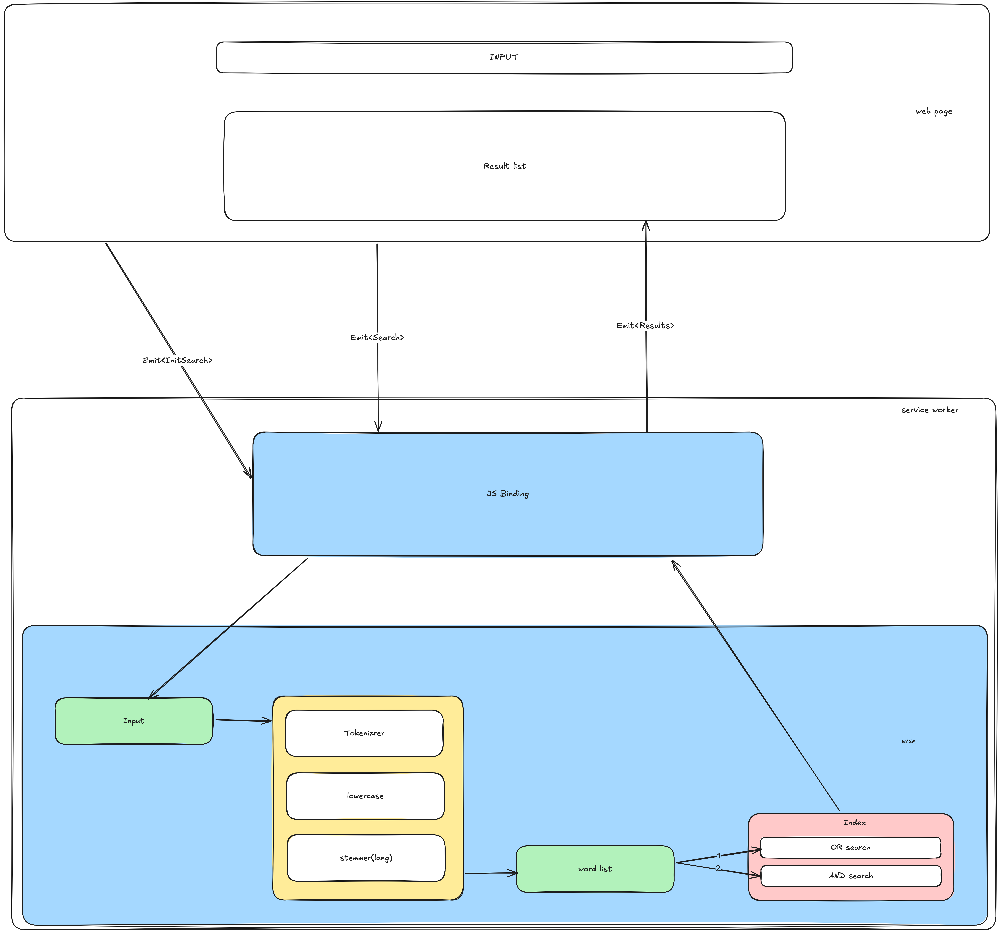

# fastfilter search


**NOTE**: this is a work in progress, and not yet ready for use.

## idea

This is - at this point a learning project for:

  - zig
  - wasm, and running wasm in the browser

Idea implement text search in the browser using wasm and zig. See [references](#references) for similar approaches..


## Requirements

- zig >= 0.14

## Tests

Using `nix` tests can be run like

```bash
$ nix develop -c zig build test --summary all
```

## references

 - [zg unicode handling](https://codeberg.org/atman/zg)
 - [crane search](https://github.com/healeycodes/crane-search)
 - [blog post on rust solution](https://dawchihliou.github.io/articles/i-built-a-snappy-full-text-search-with-webassembly-rust-nextjs-and-xor-filters) and [fulltext search code](https://github.com/DawChihLiou/dawchihliou.github.io/tree/main/wasm/fulltext-search)
 - [tinysearch](https://github.com/tinysearch/tinysearch) and [tinysearch blog post](https://endler.dev/2019/tinysearch)
